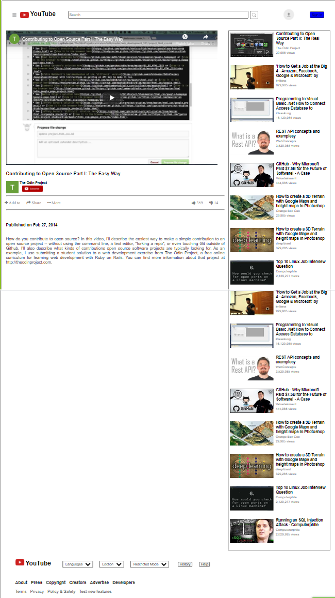

# EMBEDDING IMAGES AND VIDEO

> This is our first Microverse project where we have to clone a YouTube video viewing page.

This is a youtube video player homepage. It has as a navigation bar. In the main section there is a video section and sidebar. It also has a footer.

## Built With

- Major languages: HTML & CSS
- Frameworks: None

## Live Demo

[Live Demo Link](https://kingobaino1.github.io/YouTube-Project)

## Getting Started

**Log on to the Github and clone the repository to our local machine.**
**Modify this file to match your project, remove sections that don't apply. For example: delete the testing section if the currect project doesn't require testing.**

To get a local copy up and running follow these simple example steps.

### Prerequisites

### Setup

### Install

### Usage

### Run tests

### Deployment

## Authors

👤 **Author1**

- Github: [@githubhandle](https://github.com/Kingobaino1)
- Twitter: [@twitterhandle](https://twitter.com/ibehkingso)
- Linkedin: [linkedin](https://www.linkedin.com/in/ibeh-kingsley-obinna-568596177)

👤 **Author2**

- Github: [@githubhandle](https://github.com/abmasadullah)
- Twitter: [@twitterhandle](https://twitter.com/abmasadullah)
- Linkedin: [linkedin](https://www.linkedin.com/in/abmasadullah)

## 🤝 Contributing

Contributions, issues and feature requests are welcome!

Feel free to check the [issues page](https://github.com/Kingobaino1/YouTube-Project).

## Show your support

Give a ⭐️ if you like this project!

## Acknowledgments

- Hat tip to anyone whose code was used
- Inspiration
- etc

## 📝 License

This project is [MIT](lic.url) licensed.
